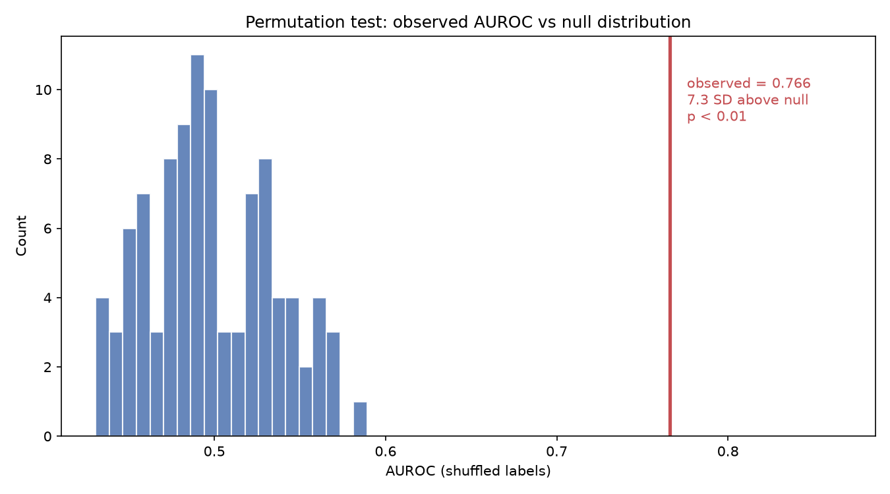
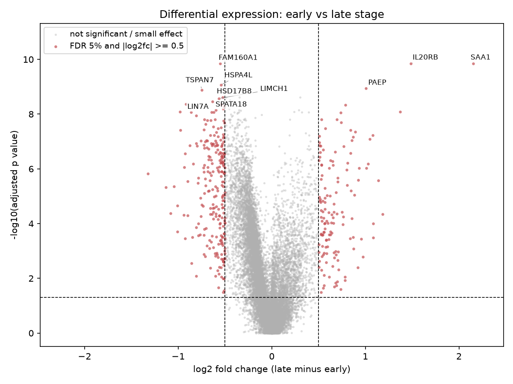

# Kidney Cancer Stage Prediction from Gene Expression

Can early vs late stage kidney cancer (TCGA KIRC) be predicted from bulk RNA seq gene expression, and which genes are most associated with stage?

## Data

TCGA KIRC from NCI GDC. 530 patients, 19,938 protein coding genes, binary
label (early = Stage I/II, late = Stage III/IV, 324 vs 206 patients).

## Method

log2(TPM+1) → StandardScaler → PCA (50 components) → classifier, all inside
a single pipeline evaluated with stratified 5 fold cross validation.
Compared Logistic Regression, Random Forest, and XGBoost against a majority
class baseline.

## Results

| Model | Accuracy | AUROC |
|---|---|---|
| Logistic Regression | 70.2% | 0.766 |
| XGBoost | 71.9% | 0.746 |
| Random Forest | 68.3% | 0.746 |
| Majority baseline | 61.1% | 0.500 |

Late stage recall is 0.39 to 0.56 across models, the main limitation. A
permutation test (100 label shuffles) confirmed the signal is real: null
AUROC centered at 0.498, observed 0.766 sits 7.3 SD above it (p < 0.01).



## Gene findings

Model weights (projected LR coefficients through PCA) pointed to cancer and
testis antigen genes, but an independent differential expression test
(Mann Whitney, FDR 5%, |log2fc| >= 0.5) found the opposite: those genes were
depleted, not enriched. The 375 genes that did pass both thresholds show a
coherent pattern instead: inflammation up (SAA1, IL20RB), vascular and
tubular genes down (TSPAN7, PTPRB, AGTR1), proliferation up (UBE2C).



## Limitations

- Late stage recall too low for clinical use
- No single gene from the model survives independent validation
- TCGA KIRC only, not externally validated

```
src/
  build_dataset.py            builds data/processed/ from raw files
  train.py                    trains models, evaluates, saves gene weights
  differential_expression.py  independent gene level significance test
  permutation_test.py         null distribution test
  plots.py                    generates the figures above
  check_data.py               data sanity checks

results/    model outputs, DE results, permutation results, figures/
data/       raw/ (gitignored) and processed/ (gitignored, regenerable)
```


## How to run

```
python src/build_dataset.py
python src/train.py
python src/differential_expression.py
python src/permutation_test.py
python src/plots.py
```

Requires `environment.yml`.
